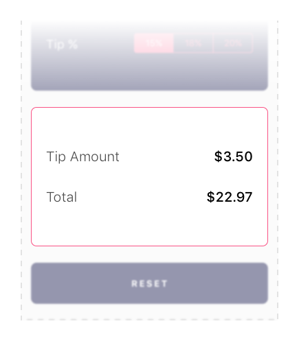
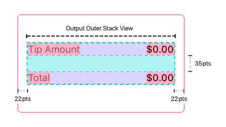
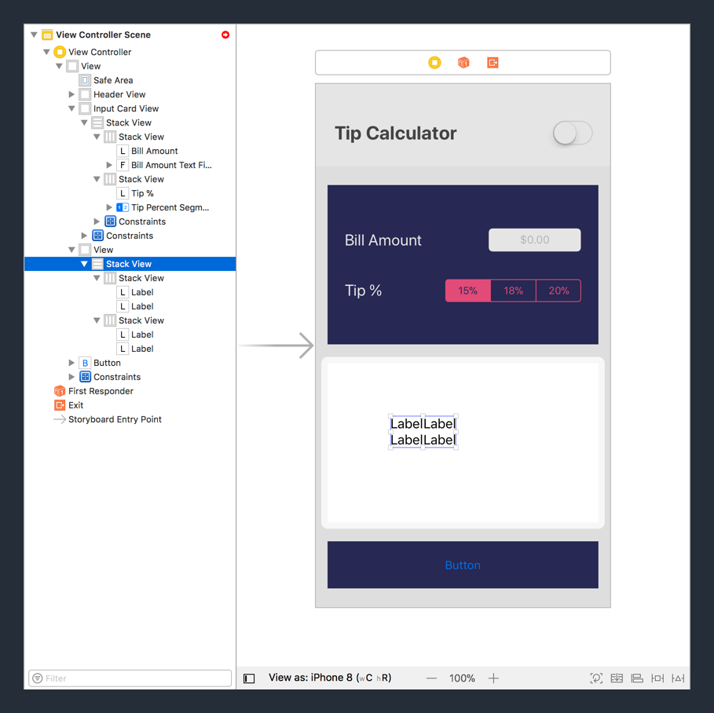
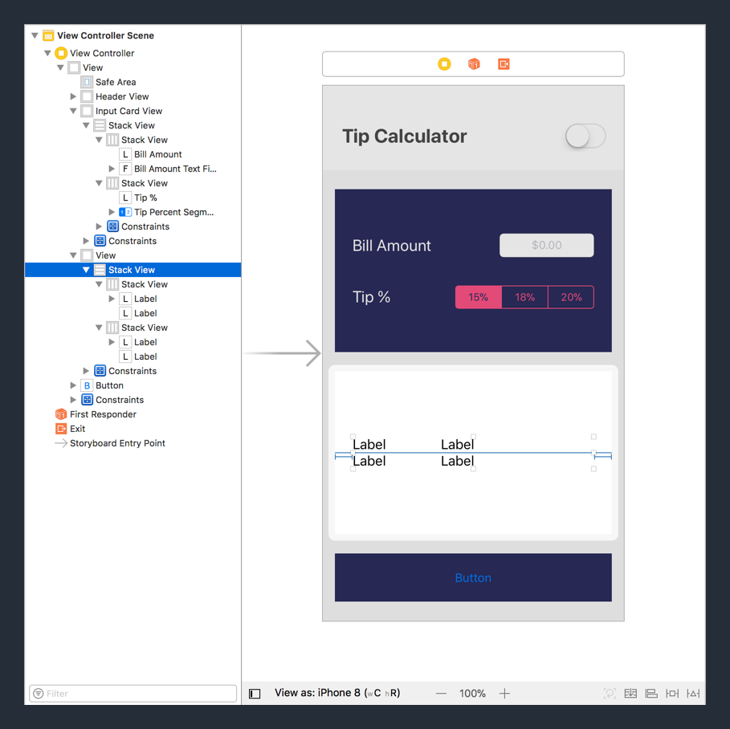
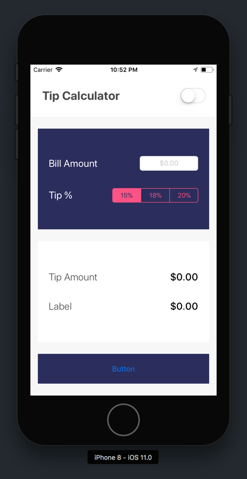
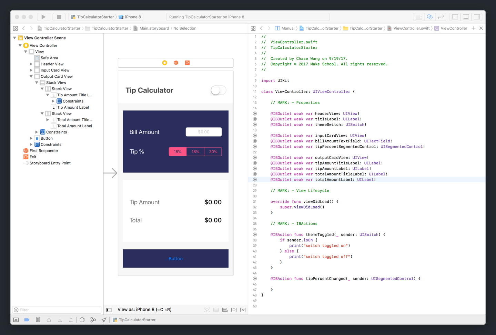
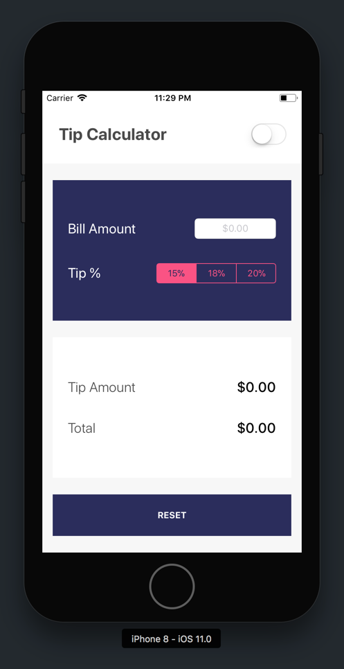
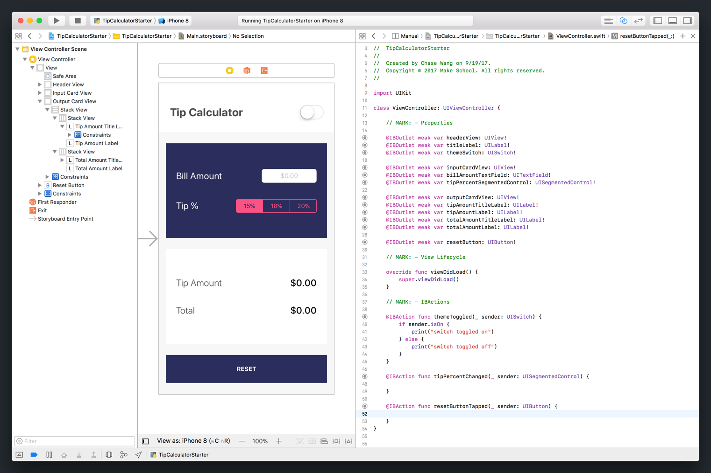
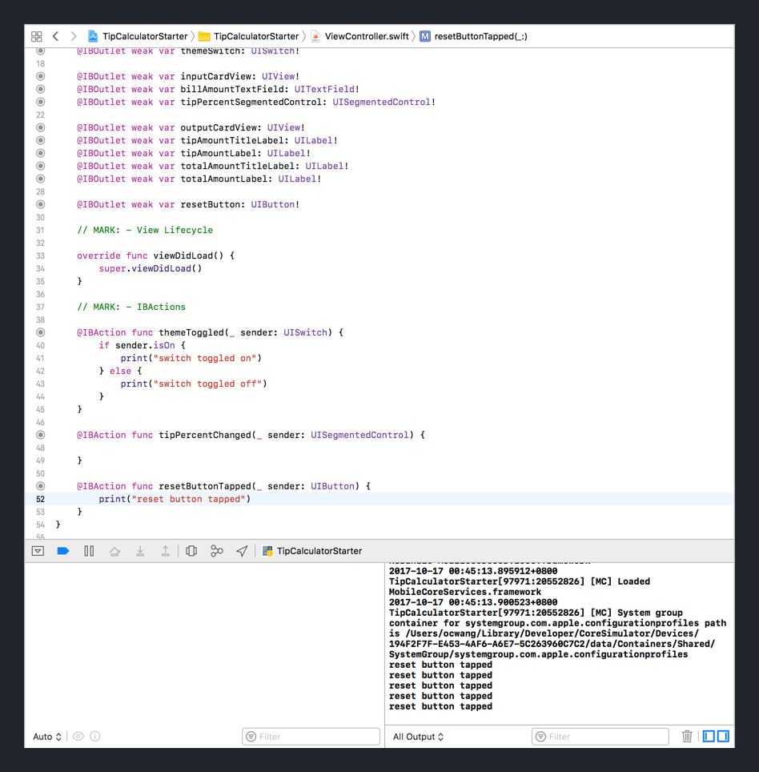

# Output Card View

You've gone through the process of implementing each of the subviews for two of the four UI groups. We'll need to do it once again. This time will be more hands-off to give you practice doing it yourself.

Let's take another look at our design:



For the output card, you need to add the following UI components:


You need to add four new labels. Next, let's think about how to layout our views.

## Identifying Constraints

Similar to to input card, you will use a combination of stack views and constraints to implement the layout.



First, you will have two horizontal stack views:

- (Inner Top Stack View) _Tip Amount Title Label_ and _Tip Amount Label_
- (Inner Bottom Stack View) _Total Amount Title Label_ and _Total Amount Label_

Next, create a outer (vertical) stack view from the two inner stack views.

Just like the input card's outer stack view,  add the following constraints to set the frame of the outer stack view:

- (Outer Stack View) Leading Edge 22pts from Super View (output card) Leading Edge
- (Outer Stack View) Trailing Edge 22pts from Super View Trailing Edge
- (Outer Stack View) Center vertically aligned with Super View Center

Finally, add a few more constraints to make sure our subview widths are the correct size:

- (Inner Top Stack View) Equal Width to Outer Stack View Width
- (Inner Bottom Stack View) Equal Width to Outer Stack View Width
- (Tip Amount Title Label) 110pts Width
- (Total Amount Title Label) 110pts Width

## Adding Constraints

You have already had practice with using stack views and constraints. This time, try practicing on your own. If you get stuck, look back on how we implemented the layout for our input card.

> [challenge] Create the inner top stack view with two `UILabel` views.

-
-
-
-
-
-
-
-
-
-
-
-
-
-
-
-
-
-
-
-

<!-- break -->

> [solution]
>
> 1. Drag two `UILabel` objects side-by-side from the _Object Library_.
> 2. Select both labels and create a horizontal stack view.

Next create the inner bottom stack view.

> [challenge] Create the inner bottom stack view with two `UILabel` views.

-
-
-
-
-
-
-
-
-
-
-
-
-
-
-
-
-
-
-
-


<!-- break -->

> [solution]
>
> 1. Drag two `UILabel` objects side-by-side from the _Object Library_. Make sure both labels are below the previous stack view.
> 2. Select both labels and create a horizontal stack view.

Next, let's create our outer stack view.

> [challenge] Create the _Outer Stack View_ using both inner (horizontal) stack views.

-
-
-
-
-
-
-
-
-
-
-
-
-
-
-
-
-
-
-
-

<!-- break -->

> [solution]
>
> 1. Collapse and select both inner stack views in the _Document Outline_.
> 2. With both inner stack views selected, click on the `Embed In Stack` button to create your outer stack view.

Your storyboard should now look like the following:



Next, let's add the constraints for our outer stack view.

> [challenge] Set the outer stack view's frame with the following constraints:
>
> - (Outer Stack View) Leading Edge 22pts from Super View (output card) Leading Edge
> - (Outer Stack View) Trailing Edge 22pts from Super View Trailing Edge
> - (Outer Stack View) Center vertically aligned with Super View Center

-
-
-
-
-
-
-
-
-
-
-
-
-
-
-
-
-
-
-
-

<!-- break -->

> [solution]
>
> 1. Select the outer stack view in the _Document Outline_.
> 2. With your outer stack view selected, click the `Add New Constraints` button.
1. Add the following two constraints using the `Add New Constraints` popup:
    - (Outer Stack View) Leading Edge 22pts from Super View (output card) Leading Edge
    - (Outer Stack View) Trailing Edge 22pts from Super View Trailing Edge
> 3. In the _Document Outline_, hold down control (ctrl) and click-drag from the outer stack view to it's super view (output card).
> 4. In the popup, select `Center Vertically In Container` to create a new constraint. This will vertically align the outer stack view's center with it's super view's center.

To finish up, we'll add the remaining width constraints.

> [challenge] Set each of the width constraints for each respective view:
>
> - (Inner Top Stack View) Equal Width to Outer Stack View Width
> - (Inner Bottom Stack View) Equal Width to Outer Stack View Width
> - (Tip Amount Title Label) 110pts Width
> - (Total Amount Title Label) 110pts Width

-
-
-
-
-
-
-
-
-
-
-
-
-
-
-
-
-
-
-
-

<!-- break -->

> [solution] To create both equal width constraints:
>
> 1. Collapse both inner stack views in the _Document Outline_.
> 2. Select the outer stack view in the _Document Outline_.
> 3. With the outer stack view selected, shift-click the bottom inner stack view to select all three stack views simultaneously.
> 4. With all stack views selected, click the `Add New Constraints` button.
> 5. Select the `Equal Widths` checkbox and click `Add 2 Constraints` to create your equal width constraints.
>
> To create each title label's fixed width constraint:
>
> 1. Select the `UILabel` object in the _Document Outline_. Make sure you're selecting the correct label.
> 2. With the label selected, click the `Add New Constraints` button.
> 3. Set a fixed width constraint of 110pts.
> 4. Repeat the previous steps for the remaining title label.

Whew! That was a lot of work in a short time. Nice job! When you're finished adding all stack views and view constraints your storyboard should look like the following:



Next, configure our output card view attributes so that it matches our designs.

## Configuring Attributes

> [challenge] Set each of the following attributes for each respective element. Remember, if you get stuck you can look back to the previous steps in the tutorial for reference.

**Output Card View:**

- _Background_: Change from `White Color` to `tcWhite`

**Outer Stack View:**

- _Spacing_: Change from `0` to `35`

**Tip Amount Title Label (Inner Top Stack View):**

- _Text_: Change from `Label` to `Tip Amount`
- _Font_: Change from `System 17.0` to `System Light 20.0`
- _Color_: Change from `Default` to `tcCharcoal`
- _Alignment_: Change from `---` to `Left Aligned`

**Tip Amount Label (Inner Top Stack View):**

- _Text_: Change from `Label` to `$0.00`
- _Font_: Change from `System 17.0` to `System Medium 20.0`
- _Color_: Change from `Default` to `tcBlack`
- _Alignment_: Change from `---` to `Right Aligned`

**Total Amount Title Label (Inner Bottom Stack View):**

- _Text_: Change from `Label` to `Total`
- _Font_: Change from `System 17.0` to `System Light 20.0`
- _Color_: Change from `Default` to `tcCharcoal`
- _Alignment_: Change from `---` to `Left Aligned`

**Total Amount Label (Inner Bottom Stack View):**

- _Text_: Change from `Label` to `$0.00`
- _Font_: Change from `System 17.0` to `System Medium 20.0`
- _Color_: Change from `Default` to `tcBlack`
- _Alignment_: Change from `---` to `Right Aligned`

Let's build and run our project to see our progress.



Our app is really starting to come along! Let's finish by creating the IB connections needed for our output card.

## Adding Our IB Connections

> [challenge] Add the following IB connections. If you find yourself stuck, look back on how we implemented our previous `IBOutlets` to refresh your memory.
>
> Use the diagram below for reference:
>
> 
>
> Create the following `IBOutlets`:
>
- `UIView` named `outputCardView`
- `UILabel` named `tipAmountTitleLabel`
- `UILabel` named `tipAmountLabel`
- `UILabel` named `totalAmountTitleLabel`
- `UILabel` named `totalAmountLabel`

When you're done, your storyboard and Swift code should look like the following:



# Reset Button

Finish the last UI group with the reset button. Unlike the other UI groups, you won't need to add any subviews or extra constraints, you just need to style the button and add it's IB connections.

## Configuring Attributes

> [challenge] You know the drill. Set each of the following attributes for the reset button:

**Reset Button:**

- _Type_: Change from `System` to `Custom`
- _Title_: Change from `Button` to `RESET`
- _Font_: Change from `System 15.0` to `System Bold 13.0`
- _Foreground_: Change from `Default` to `tcWhite`

Your reset button should look like the following when you're done:



## Creating IB Connections

Last, we'll need to add the button's IB connections.

> [challenge] Use the _Assistant Editor_ to add the following IB connections to your `ViewController` class:
>
> 1. Create an `IBOutlet` for the reset button named `resetButton`.
> 2. Create an `IBAction` for the reset button with the name `resetButtonTapped` with _Event type_ of `Touch Up Inside`.

When you're done, your storyboard and view controller source code should look like the following:



### Testing Our IBAction

Let's make sure that our `IBAction` is working as expected.

> [action] Add a print statement in your `resetButtonTapped` function to test that it's working:

```Swift
@IBAction func resetButtonTapped(_ sender: UIButton) {
  print("reset button tapped")
}
```

Build and run your project. Tap the reset button a couple of times and verify that your print statement is being output to the debug console. Each time you tap the reset button, you should see the following:



# Conclusion

That's a wrap! We've learned a ton about implementing complex layouts with _auto-layout_, constraints and stack views. In the process, we've gotten a lot of practice and implemented the majority of our UI. In the next section, we'll work on implementing the logic for our tip calculator.

# Continue to the next section

[Tip Calculator Logic](../P6-Tip-Calculator-Logic)

